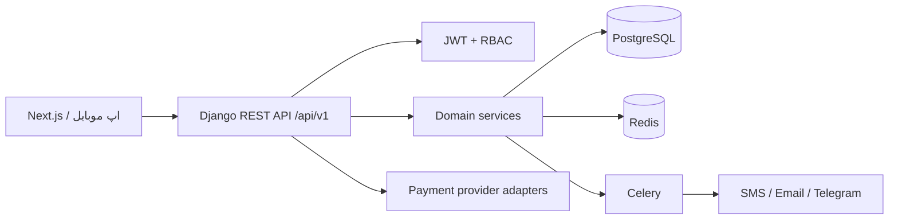

# معماری «نوبت»

## ۱. نمای کلی

سامانه به‌صورت API-first و چندمستاجره (multi-tenant) طراحی شده است. Next.js تنها مصرف‌کنندهٔ API نیست؛ اپلیکیشن موبایل و کانال‌های دیگر نیز همین قرارداد نسخه‌بندی‌شدهٔ REST را مصرف خواهند کرد.



هر شیء تجاری به `Business` متصل است. دسترسی کاربران از طریق `BusinessMember` تعیین می‌شود و ViewSetهای مدیریتی همیشه QuerySet را به کسب‌وکارهای عضو کاربر محدود می‌کنند. برای صفحات عمومی، کسب‌وکار فقط با `slug` عمومی خوانده می‌شود.

## ۲. ساختار پوشه‌ها

```text
backend/
  config/                تنظیمات، URL، Celery
  common/                مدل پایه، خطاها، RBAC و ابزارهای مشترک
  accounts/              کاربر، ثبت‌نام و JWT
  tenants/               کسب‌وکار، شعبه و عضویت‌ها
  catalog/               دسته و خدمت
  workforce/             کارکنان و برنامهٔ کاری
  appointments/          slot، رزرو و تاریخچهٔ وضعیت
  payments/              تراکنش، بازپرداخت و کد تخفیف
  engagement/            اعلان، نظر، علاقه‌مندی و Audit log
  tests/                 تست یکپارچهٔ جریان‌های حیاتی
frontend/                نقطهٔ شروع Next.js
docs/                    معماری و قرارداد API
```

## ۳. مدل‌ها و روابط

`User` هویت سراسری است. `BusinessMember` رابطهٔ کاربر و tenant و نقش او را نگه می‌دارد. `Business` چند `Branch`، `Service` و `Employee` دارد. خدمت با کارکنان به‌وسیلهٔ `EmployeeService` و با شعبه‌ها با یک رابطهٔ چندبه‌چند ارائه می‌شود.

`WorkSchedule`، `BreakTime`، `Holiday` و `EmployeeLeave` ورودی محاسبهٔ زمان آزاد هستند. هر `Appointment` به یک کسب‌وکار، شعبه، خدمت، مشتری و کارمند تخصیص‌یافته متصل است؛ تغییرات آن در `AppointmentStatusHistory` ثبت می‌شوند. `Payment` و `Refund` تراکنش‌ها را مستقل و قابل idempotency نگه می‌دارند. `Notification`، `Review`، `Favorite`، `AuditLog` و مدل‌های اشتراک نیز در دامنه پیش‌بینی شده‌اند.

ایندکس‌های tenant، بازهٔ زمان و وضعیت در مدل رزرو تعریف شده‌اند. در PostgreSQL باید migration مربوط به `ExclusionConstraint` نیز فعال شود تا حتی در سطح دیتابیس، دو بازه برای یک کارمند هم‌پوشانی نداشته باشند؛ سرویس رزرو هم‌زمان با آن `select_for_update` را به‌کار می‌گیرد.

## ۴. جریان رزرو و جلوگیری از تداخل

1. مشتری شعبه، خدمت، تاریخ و کارمند دلخواه یا «فرقی ندارد» را انتخاب می‌کند.
2. API زمان‌های آزاد را در backend از ساعت شعبه/کارمند، استراحت، مرخصی، تعطیلات و رزروهای فعال محاسبه می‌کند.
3. هنگام ثبت، یک transaction آغاز می‌شود و رکورد کارمند با `select_for_update()` قفل می‌شود.
4. رزروهای هم‌پوشان همان کارمند نیز با lock خوانده و دوباره بررسی می‌شوند.
5. رزرو با کد رهگیری یکتا ثبت می‌شود. در صورت بیعانه، وضعیت `pending_payment` است؛ در غیر این صورت `confirmed`.
6. Celery اعلان تأیید و reminderها را ارسال می‌کند.

هم‌زمانی دو درخواست برای یک کارمند با قفل ردیف کارمند serialize می‌شود؛ constraint دیتابیس لایهٔ نهایی محافظت در production است. پرداخت نیز یک `idempotency_key` یکتا دارد تا callback تکراری دوباره اثر نگذارد.

## ۵. دسترسی‌ها

| نقش | سطح دسترسی |
| --- | --- |
| مدیر کل | همهٔ tenantها و تنظیمات پلتفرم |
| مالک | همهٔ داده‌های کسب‌وکار خود |
| مدیر شعبه | شعبه‌های تخصیص داده‌شده |
| کارمند | فقط پروفایل و نوبت‌های خود |
| مشتری | رزروها، پرداخت‌ها و بازخورد خودش |

## ۶. Docker و عملیات

`docker-compose.yml` شامل Django API، PostgreSQL، Redis، Celery Worker، Celery Beat و Next.js است. تمام مقادیر محرمانه در `.env` نگهداری می‌شوند. در production باید HTTPS، ذخیره‌سازی شیءگرا برای media، مانیتورینگ، backup و rate limiting در reverse proxy فعال شوند.

## ۷. نقشهٔ راه

1. **هستهٔ فعلی:** مدل tenant، کاتالوگ، زمان‌بندی، رزرو تراکنشی، JWT و قرارداد OpenAPI.
2. تکمیل SMS/email providerها، درگاه پرداخت واقعی و Jobهای یادآوری.
3. Next.js (تقویم شمسی/میلادی، پنل نقش‌محور، i18n و dark mode).
4. گزارش CSV/XLSX/PDF، اشتراک‌ها، قابلیت‌های تحلیلی و اپ موبایل.
5. Sentry، metrics، CI/CD، تست بار و بازبینی امنیتی قبل از انتشار.

